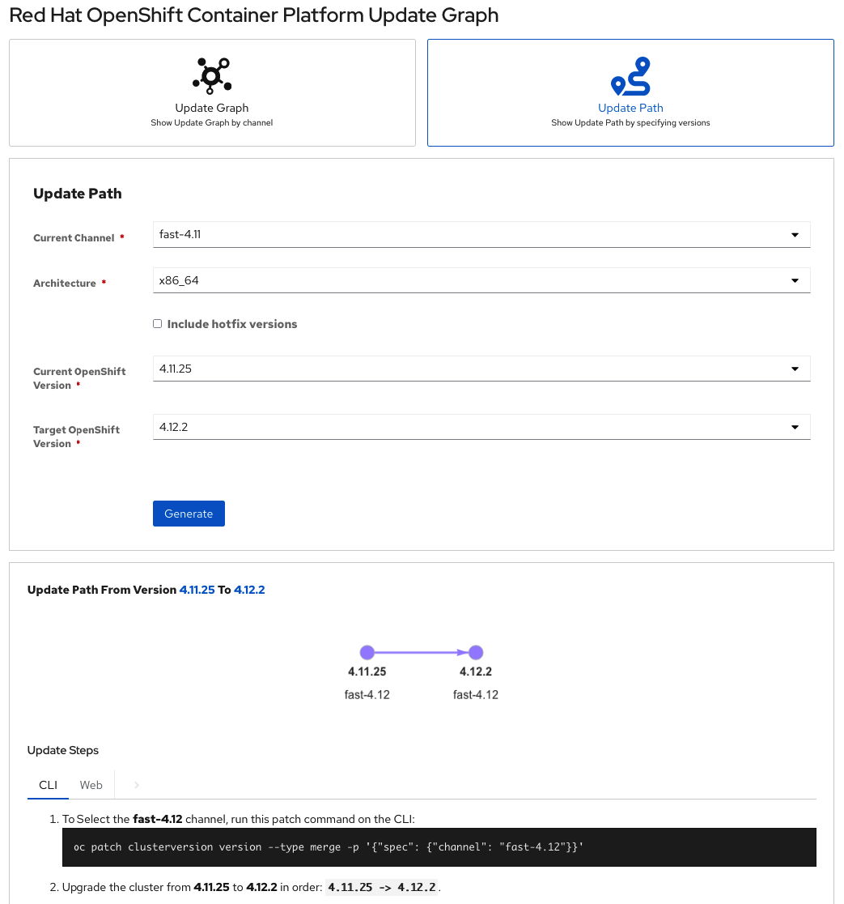
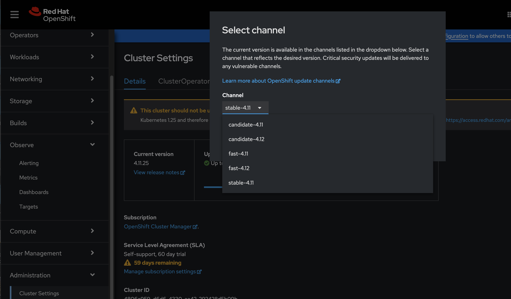

- 0 - First check what path will be feasible and battle tested to upgrade to. Check this [SITE](https://access.redhat.com/labs/ocpupgradegraph/update_channel)

   - Check your current status
     > $ oc get clusterversion -o json|jq ".items[0].spec"
     >

         raf@st :  /home/raf/4.11
          ➡  oc get clusterversion -o json|jq ".items[0].spec"
         {
           "channel": "stable-4.11",
           "clusterID": "4806a959-d6d6-4330-aa42-292428d5b09b"
         }

   Once the minor version channel is determined

  

- 1 - To Select the fast-4.12 channel either CLI or Openshift WebConsole

  - Run this patch command on the CLI
  > $ oc patch clusterversion version --type merge -p '{"spec": {"channel": "fast-4.12"}}'
  >

  - Updating channel graphically, __*Administration*__ > __*Cluster Setting*__ > click on channel (__*stable-4.11*__)

    

- 2 - Set the updated secret in the Openshift cluster

   - Extract current pull-secret in order to update with the credential of the new registrySources
       > $ oc get secret/pull-secret -n openshift-config -o jsonpath="{.data.\\.dockerconfigjson}"  | base64 -d >> pull-secret.json
       >

   - Encode the `user:password` to base64
     > $ echo -n "quayadmin:quaypass123" | base64
     >

         cXVheWFkbWluOnF1YXlwYXNzMTIz

   - Edit pull-secret.json as follows
     > $ cat pull-secret.json
     >

         {
           "auths": {
             "quay.io": {
               "auth": "xxx",
               "email": "myemail@xxx.com"
             },
             "registry.connect.redhat.com": {
               "auth": "xxx",
               "email": "myemail@xxx.com"
             },
             "registry.redhat.io": {
               "auth": "xxx",
               "email": "myemail@xxx.com"
             },
             "registry.sandbox2278.opentlc.com": {
               "auth": "cXVheWFkbWluOnF1YXlwYXNzMTIz",
               "email": "myemail@xxx.com"
             }
           }
         }

   - Get current global secret (two options)
     > $ oc get secret/pull-secret -n openshift-config --template='{{index .data ".dockerconfigjson" | base64decode}}' > pull-secret.json
     >
     > oc get -o json secret/pull-secret -n openshift-config | jq -r '.data.".dockerconfigjson"' | base64 -d > pull-secret.json
     >

   - Set the updated secret in the openshift cluster
     > $ oc set data secret/pull-secret -n openshift-config --from-file=.dockerconfigjson=pull-secret.json
     >

- 3 - Enable Openshift Cluster to use the mirror registry as source, and configure in which way the custom registries will be accessed. More Detail information [HERE](https://docs.openshift.com/container-platform/4.12/openshift_images/image-configuration.html)
  > $ oc edit image.config.openshift.io/cluster
  >
      ...
      spec:
        ...
        registrySources:
          allowedRegistries:
          - quay.io
          - registry.redhat.io
          - image-registry.openshift-image-registry.svc:5000
          - registry.sandbox2278.opentlc.com:8443
          insecureRegistries:
          - registry.sandbox2278.opentlc.com

__NOTE: When the allowedRegistries parameter is defined, all registries, including the registry.redhat.io and quay.io registries and the default internal image registry, are blocked unless explicitly listed. If you use the parameter, to prevent pod failure, you must add the registry.redhat.io and quay.io registries and the internalRegistryHostname to the allowedRegistries list, as they are required by payload images within your environment__

- 4 - Configure the `ImageContentSourcePolicy` to make the cluster point to the mirror registry 

      echo -n 'apiVersion: operator.openshift.io/v1alpha1
      kind: ImageContentSourcePolicy
      metadata:
        name: example
      spec:
        repositoryDigestMirrors:
        - mirrors:
          - registry.sandbox2278.opentlc.com:8443/ocp4/openshift4
          source: quay.io/openshift-release-dev/ocp-release
        - mirrors:
          - registry.sandbox2278.opentlc.com:8443/ocp4/openshift4
          source: quay.io/openshift-release-dev/ocp-v4.0-art-dev' | tee image-content-source-policy.yaml

    > $ oc apply -f image-content-source-policy.yaml
    >

- 5 - (optional) If the cluster was firstly online, disable the sample operator
  > $ oc edit configs.samples.operator.openshift.io -n openshift-cluster-samples-operator
  >

      apiVersion: samples.operator.openshift.io/v1
      kind: Config
      metadata:
        name: cluster
      spec:
        architectures:
        - x86_64
        managementState: Removed

---

- More docs [HERE](https://access.redhat.com/documentation/en-us/openshift_container_platform/4.12/html-single/images/index)

