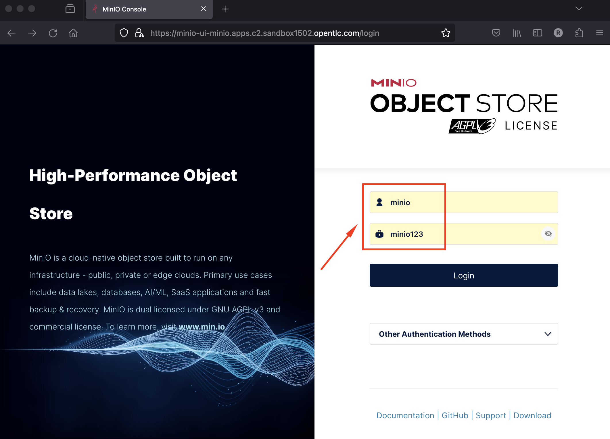

# Minio Object Storage

This guide is a very quick way of deploying the community version of Minio in order to quickly setup a fully standalone Object Store, in an OpenShift Cluster. This can then be used for various prototyping tasks that require Object Storage. This guide is a very quick way of deploying the community version of Minio in order to quickly setup a fully standalone Object Store, in an OpenShift Cluster. This can then be used for various prototyping tasks that require Object Storage.

Note that nothing in this guide should be used in production-grade environments.


## Pre-requisites
  - Access to an OpenShift cluster
  - Namespace-level admin permissions, or permission to create your own project

## Deploying Minio on OpenShift

#### 1 - Create a Data Science Project
```bash
oc new-project minio
```

#### 2 - Create a Data Science Project
```bash
oc apply -f https://gitlab.com/rcardona/ocp4-tasks/-/raw/master/storage/minio-deployment.yaml
```

#### 3 - Find the mino application endpoint
```bash
oc get routes -n minio
```

```text
raf@rhel8 :  /ocpv14.4
➡ oc get routes
NAME        HOST/PORT                                         PATH   SERVICES        PORT   TERMINATION     WILDCARD
minio-api   minio-api-minio.apps.c2.sandbox1502.opentlc.com          minio-service   api    edge/Redirect   None
minio-ui    minio-ui-minio.apps.c2.sandbox1502.opentlc.com           minio-service   ui     edge/Redirect   None
```

#### 4 - Access the Web UI of minio with user/password from the deployment (minio/minio123)
---


---


